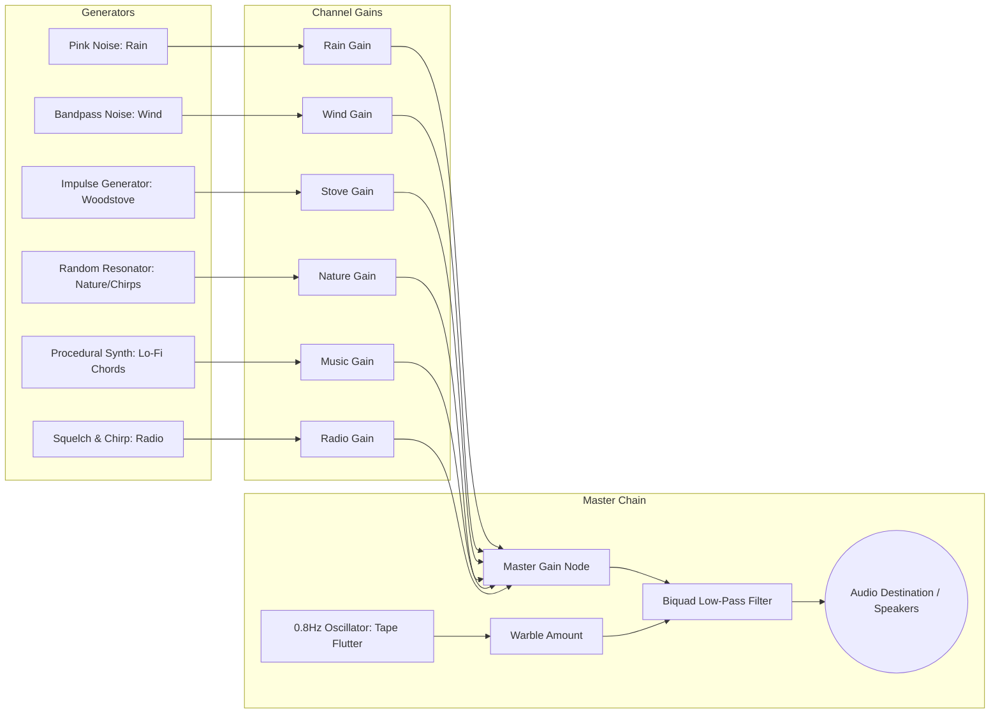

# 🎧 Web Audio API Procedural Sound Architecture

**Two-Pines** employs a zero-asset, 100% procedural audio synthesis engine implemented in [`src/audio/SoundEngine.js`](file:///c:/Users/ADMIN/Downloads/Work/Projects/Javascript%20projects/forest-fire-watch/src/audio/SoundEngine.js). This guarantees zero asset download latency, dynamic infinite variations, and complete real-time parameter modulation.

---

## 🎛️ Audio Node Routing Graph

---

## 🌲 Synthesizer Implementations

### 1. 🌧️ Rain Soundscape
* **Core**: Pink noise buffer generated via Paul Kellet's filtered white noise algorithm.
* **Filter**: Resonant low-pass filter modulated by rain intensity.
* **Droplet Impulses**: Randomized short bandpass impulse bursts ($2.5\text{ kHz} - 4.5\text{ kHz}$) simulating droplets on the metal lookout roof.

### 2. 💨 Wind in the Pines
* **Core**: White noise source passed through a high-$Q$ Biquad bandpass filter ($250\text{ Hz} - 800\text{ Hz}$).
* **Modulation**: Dual low-frequency oscillators ($0.15\text{ Hz}$ and $0.05\text{ Hz}$) dynamically sweep frequency and gain to simulate natural mountain gusts.

### 3. 🔥 Woodstove Fire & Crackle
* **Drone**: Sub-bass sine oscillator ($45\text{ Hz}$) simulating internal stove draft.
* **Pops & Snaps**: Stochastic Poisson impulse triggers routed into high-pass filter ($1.2\text{ kHz}$) with rapid exponential decay envelopes ($15\text{ms} - 40\text{ms}$).

### 4. 🎹 Procedural Lo-Fi Chords
* **Progression**: Smooth cycle through jazz/lo-fi voicings:
  $$\text{Dmaj7} \longrightarrow \text{Bm7} \longrightarrow \text{Gmaj7} \longrightarrow \text{A7sus4}$$
* **Oscillators**: Soft triangle and sine waves with gentle low-pass warmth ($1.4\text{ kHz}$) and subtle chorus detuning ($\pm 4\text{ cents}$).

### 5. 📻 Walkie-Talkie Radio Squelch & Voice Chirps
* **Squelch**: High-pass filtered noise burst with steep bandpass resonance ($300\text{ Hz} - 3.4\text{ kHz}$) simulating analog RF squelch gate opening/closing.
* **Voice Chirps**: Multi-tone FM synthesizer blips keyed to typewriter text characters with variable pitch ($280\text{ Hz} - 520\text{ Hz}$) for expressive communication.

### 6. 📼 Vintage Tape Warble (Master Effect)
* **Filter Flutter**: Biquad low-pass filter driven by a slow $0.8\text{ Hz}$ sine LFO to reproduce the nostalgic wow & flutter of magnetic cassette tape.

---

## ⚡ Performance & Resource Management

* **Lifecycle**: AudioContext is lazily initialized on the first user interaction (pointer click or keydown) to comply with browser autoplay policies.
* **Automatic Teardown**: Inactive oscillators and noise nodes are disconnected immediately to maintain low CPU utilization ($< 2\%$ on mobile devices).
