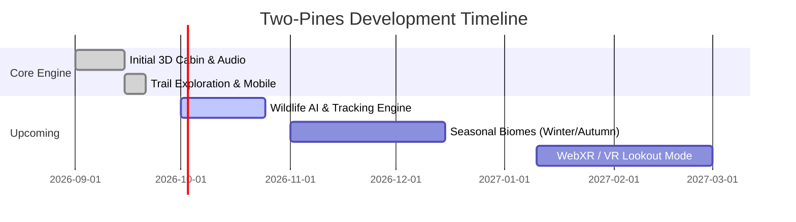

# 🗺️ Two-Pines Product Roadmap

This document outlines the strategic vision, upcoming milestones, and community-driven feature requests for **Two-Pines: Cozy Forest Fire Watch**.

---

## 🎯 Vision

To create the ultimate cozy, atmospheric wilderness simulation accessible instantly in any web browser — combining rich 3D graphics, procedural audio relaxation, and engaging narrative storytelling with zero load time.

---

## 📅 Roadmap Milestones

---

### 🌿 Milestone 1.3: Wildlife AI & Environmental Interactions
- [ ] **Dynamic Animal AI**:
  - Roaming deer and wandering elk herds with procedural pathing along Meadow Creek.
  - Soaring golden eagles with randomized thermal updraft circling.
  - Nighttime fireflies and glowing nocturnal moths near the cabin lantern.
- [ ] **Backcountry Fire Physics**:
  - Dynamic smoke column simulation driven by real-time wind speed and direction.
  - Alidade mapping tool inside the cabin for triangulating smoke bearings.
- [ ] **Field Guide Expansion**:
  - Flora & fauna taxonomy pages with collectible botanical sketches.

---

### ❄️ Milestone 1.4: Seasonal Biomes & Advanced Weather
- [ ] **Winter Season Mode**:
  - Procedural snow accumulation shaders on cabin roof, railings, and pine branches.
  - Frozen lake surface with creaking ice audio synthesis.
  - Blizzard storm weather preset with howling sub-bass wind drafts.
- [ ] **Autumn Amber Mode**:
  - Golden aspen foliage color variations and falling leaves particle system.
- [ ] **Custom Audio Mixer Presets**:
  - User-savable mix configurations (e.g., "Thunderstorm Study", "Cabin Reading", "Late Night Lo-Fi").

---

### 🥽 Milestone 2.0: WebXR & Immersion
- [ ] **WebXR VR Support**:
  - 6-DoF VR headset support for Meta Quest and PC VR headsets directly in WebXR.
  - Physical hand tracking for picking up the walkie-talkie and adjusting the brass spotting scope.
- [ ] **Spatial 3D Audio**:
  - Full Web Audio HRTF panner nodes for positional woodstove crackling and directional thunder strikes.
- [ ] **Voice-Activated Radio Mode**:
  - Optional Web Speech API microphone push-to-talk recognition for responding to Ranger Willow.

---

## 💡 Submitting Feature Requests
Have an idea or feature proposal? Please open an issue on GitHub tagged with `enhancement` or join our community discussions!
